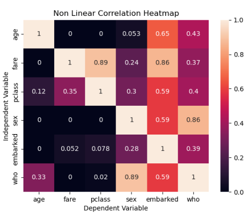

# Non Linear Correlationship

In this repository I have made a few functions that will help to find correlation between various features in a data set these features in most cases can be categorical as well as numerical and the function will still be able to find out the correlation between them.  
 
## How it works  
 
1. The function takes in a data set and a target variable as input.
2. The function then finds out the correlation between the target variable and all the other features in the data set by mapping the dependent variable onto the independent variable by using a decision tree. 
3. The test accuracy of this decision tree is called as correlation in our case. 

## How to use it ? 

1. get the base file 'non_linear_correlation.py' and put it in your project repo. 
2. import the file in your project, for example take a look at 'testing the function.py' file.

## Example 

```python
from non_linear_correlation import non_linear_correlation
from non_linear_correlation import correlation_heatmap
import pandas as pd
import numpy as np
import seaborn as sns


# Load Titanic dataset
titanic = sns.load_dataset('titanic')

# Display the first few rows of the dataset
print(titanic.info())
print(titanic.head())

# Select numerical and categorical columns for demonstration
numerical_cols = ['age', 'fare', 'pclass']
categorical_cols = ['sex', 'embarked', 'who']

# the code is based on the dtype , so if the dtype if none of int, float, bool, then it must be 'object' nothing else.
# Combine selected columns into a new DataFrame
selected_columns = numerical_cols + categorical_cols
titanic_df = titanic[selected_columns]

# Display the first few rows of the new dataset
print(titanic_df.info())
print(titanic_df.head())

# Make the correlation heatmap
print(non_linear_correlation(titanic_df['age'], titanic_df['class']))
print(correlation_dataframe(titanic_df))
correlation_heatmap(titanic_df)
```

## Output 




## Interpretation

these are the accuracy of prediction of dependent variable by the independent variable. If the number is 0 
then it means that predictability (and correlation) by extension is 0. Basically, you can't really say anything. 
If the number is 1 then it means that the predictability is 1. So, you can say that the correlation is 1.


### Why are the numbers not same diagonally ?

Becuase it is totally possible that fare can very accurately give you passenger class, but if you give someone passenger class, you can't really say what the fare is with the same accuracy the other way around.

## Use cases

1. You can directly this function to find out the correlation between various features in your data set. Linear as well as correlation. It's good as the first insight. 
2. You'll better know which features to 